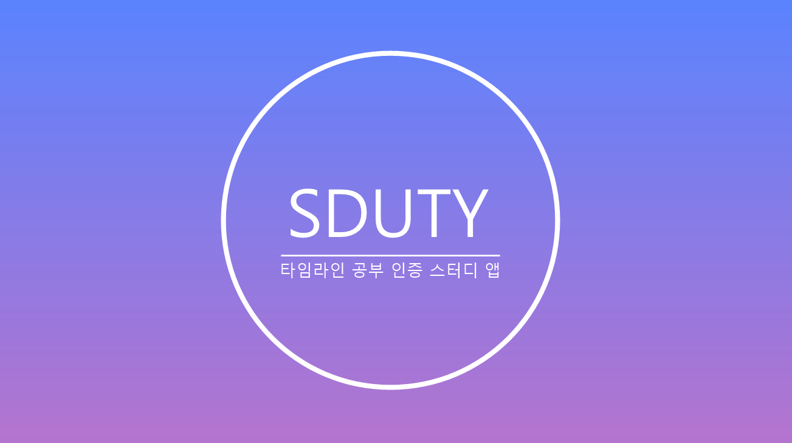
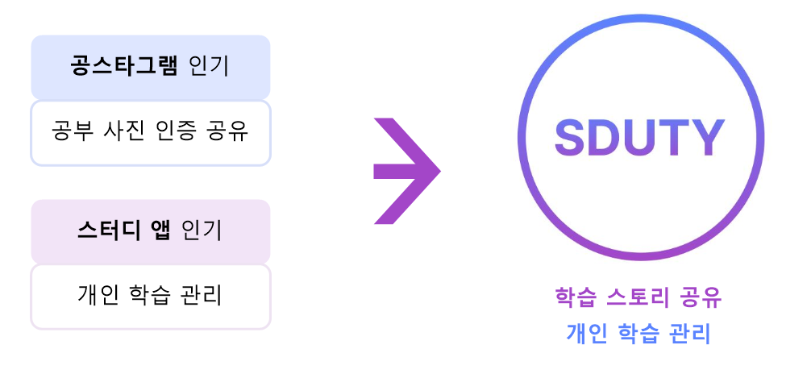
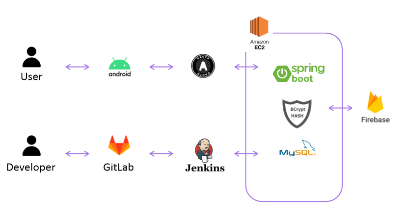
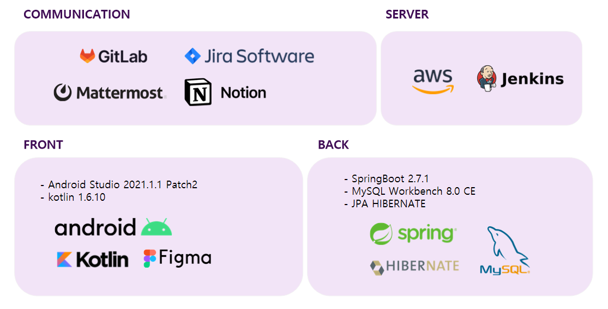

# 💬 Sduty

    

타임라인 공부 인증 스터디 앱, `Sduty`입니다.

Study의 t와 d의 위치를 바꾼 애너그램으로 `Study` + `duty` 의무적으로 공부하자라는 의미를 담았습니다.
 

## 🎇 기획 배경

    

공부할 때 딴짓 하게 되시는 분들,

공부인증 공유하고 싶은신 분들을 위한

공부 사진 인증 공유와 개인 학습 관리를 다루는 `통합 학습 지원 플랫폼`입니다.

1. 학습과 관련된 스토리를 공유할 수 있으며 일정 관리를 통해 공부 습관을 관리할 수 있습니다.
2. 캠 스터디를 활용하여 독서실에 있는 듯 공부를 자극할 수 있습니다.
3. 다른 앱 차단 기능을 통해 공부에 더욱 집중할 수 있습니다.

 

## 🖥️ 시스템 아키텍처

    

저희 서비스의 아키텍처입니다. 깃랩에서 `Push Event`가 발생하면 Webhook에 의해 젠킨스로 소스 파일이 전송됩니다. 해당 소스 파일을 이용해 `[build - test - deploy]`로 이루어지는 CI/CD 환경을 구축하였습니다.

 

## 📱 기술 스택

    

 

## 🌈 서비스 기능

저희 서비스의 기능은 크게 타임라인, 타이머&리포트, 스터디 기능으로 나뉩니다. 

❤️ 타임라인

- [타임라인](./assets/md/timeline.md)

- [스토리 등록](./assets/md/add_story.md)

- [스크랩](./assets/md/scrap.md)

- [좋아요, 댓글](./assets/md/like_reply.md)

- [타임라인 필터링](./assets/md/timeline_filtering.md)

- [마이페이지](./assets/md/my_page.md)

⏱ 타이머 & 리포트

- [타이머](./assets/md/timer.md)

- [리포트](./assets/md/report.md)

👨‍👩‍👧‍👦 스터디

- [일반 스터디](./assets/md/study.md)

- [캠 스터디](./assets/md/cam_study.md)

✨ 부가 기능

- [앱 잠금](./assets/md/app_lock.md)

- [공지사항, 문의](./assets/md/notice_help.md)

[회원 관리]

 

## 🔖 프로젝트 빌드 방법

빌드 매뉴얼은 길어질 것 같아 파일로 만들어 두었습니다.

    
        
    

 

## 📝 노션 페이지

저희 프로젝트의 문서와 저희 팀원들이 어떤 방법론에 맞춰 작업했는지 노션을 통해 알 수 있습니다.

    

