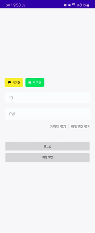

# 캠 스터디

스터디원들과 화상 통화를 할 수 있어요. 캠스터디는 모각코, 강의 등 다양한 용도로 사용할 수 있어요. 스터디원들에게 일정 시간마다 스터디 시작 알림을 보낼 수 있어요.

    

# 기능 요약
1. 캠 스터디로 설정된 스터디 입장

2. 입장 전 화면 및 마이크 설정 가능

3. 일정 시간마다 스터디 시작 알림

4. 화상 회의에 필요한 다양한 기능(카메라 전환, 음소거, 캠 끄기 등) 지원
